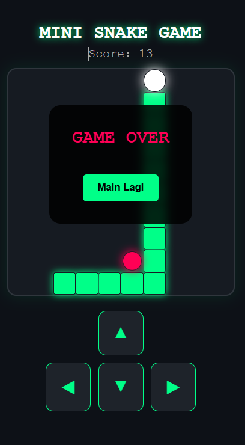

# 🐍 Mini Snake Game

A simple browser-based Snake game built using HTML, CSS Grid, and Vanilla JavaScript.  
This project demonstrates fundamental game logic, DOM manipulation, and responsive layout design without any external libraries.

---

## 🚀 Live Preview

> https://revanyangel.github.io/mini-snake-game/

  

---

## 🎮 Game Overview

Mini Snake Game is a classic 10x10 grid snake game where:

- The snake moves across the board
- Eats food to increase score
- Grows longer each time it eats
- Game ends when it hits the wall or itself

Built entirely with pure frontend technologies.

---

## ✨ Features

- ✅ 10x10 Grid system using CSS Grid
- ✅ Score tracking
- ✅ Game Over modal overlay
- ✅ Restart button
- ✅ Keyboard controls (Arrow keys)
- ✅ On-screen touch controls (mobile friendly)
- ✅ Food spawn logic (avoids spawning inside snake)
- ✅ Collision detection (wall & self)

---

## 🛠 Tech Stack

- **HTML5** – Structure
- **CSS3** – Styling & layout (CSS Grid + animations)
- **JavaScript (Vanilla)** – Game logic & DOM manipulation

No frameworks. No dependencies.

---

## 🧠 How It Works

### 1. Game Initialization
- Snake starts at center of grid
- Food generated randomly
- Score reset to 0
- Game loop runs every 200ms

### 2. Game Loop
- Updates direction
- Moves snake head
- Checks collision:
  - Wall collision
  - Self collision
- Checks if food is eaten
- Updates score & snake length
- Redraws board

### 3. Rendering
- Board cleared each frame
- Snake segments rendered using `grid-area`
- Food rendered dynamically

---

## 🎯 Controls

### Keyboard
- ⬆ Arrow Up
- ⬇ Arrow Down
- ⬅ Arrow Left
- ➡ Arrow Right

### Mobile
- On-screen directional buttons

---

## 🖥 How to Run

1. Download or clone the repository
2. Keep all files in the same directory
3. Open `index.html` in your browser

That’s it. No setup required.

---

## 📌 Key Concepts Practiced

- DOM manipulation
- Game loop using `setInterval`
- Collision detection logic
- Dynamic element rendering
- Grid-based positioning
- Basic game state management

---

## 👤 Author

Developed as a mini frontend project.
